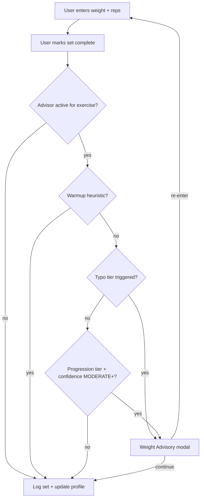

# Weight Advisor Architecture

Design reference for Phase 2 implementation. **No runtime behavior changes until that phase.**

## Principle

Detect accidental entries, not legitimate training decisions. Load warnings are fat-finger guards (decimal errors, wrong plate math), not coaches blocking periodization jumps. Hypertrophy apps should warn rarely and allow override always.

## Current State (pre-redesign)

| Component | Location |
|-----------|----------|
| Weight jump check | `kinetiq-app/app/workout/[id]/page.tsx` |
| Modal | `kinetiq-app/components/WeightJumpWarningModal.tsx` |
| Threshold constant | `WEIGHT_JUMP_THRESHOLD = 0.15` in `kinetiq-app/lib/api/workouts.ts` |

**Behavior today:**

- Triggers on set complete when `weight > historicalBest * 1.15`
- `historicalBest` = max of completed sets in current session and `prescription.historicalBestWeight` (latest `PerformanceHistory.bestWeight` row)
- No confidence gate, no warmup exclusion, no per-exercise history depth check
- Copy frames as injury risk ("may significantly increase injury risk")

The progression engine already has a confidence model (`kinetiq-api/src/progression-engine/layers/confidence.service.ts`) but the Weight Advisor does not use it. There is no `isWarmup` flag on `Set`.

## 1. Confidence Building Phase

**Per exercise**, not per app install.

| Signal | Minimum | Rationale |
|--------|---------|-----------|
| Completed workouts containing exercise | 3 | One session is calibration noise |
| Working sets logged (non-warmup) | 8–10 | Enough for distribution, not one outlier set |
| Distinct calendar days | 2+ | Separates same-session warmup/working confusion |
| PerformanceHistory rows | 3+ | Aligns with progression engine `dataDepth` |

**Activation rule:** Advisor inactive until all minimums are met for that `userId + exerciseId`.

Reuse progression engine `ConfidenceLevel`:

- `INSUFFICIENT_DATA` / `VERY_LOW` → no weight warnings
- `LOW` → only extreme typo tier (see thresholds)
- `MODERATE+` → standard advisory tier

## 2. Baseline Selection

**Do not use:** previous set alone, single PR, or raw session max.

**Recommended baseline: rolling working-set profile**

```
baselineWeight = P75–P90 of working sets (last 90 days, last 6 sessions max)
baselineE1RM   = rolling median e1RM from PerformanceHistory / Set table
```

Compare entered set using e1RM equivalence when reps differ materially:

```
estimatedE1RM = weight * (1 + reps/30)   // Epley; fine for advisory
warn if enteredE1RM > baselineE1RM * (1 + threshold)
```

**Session context:** exclude current set and prior sets in the same exercise below working threshold from baseline pool.

## 3. Warmup Detection

**Phase 1 (heuristic, no schema change):**

- Set is warmup if `weight < 0.65 * sessionWorkingMax` for that exercise
- Or `reps > prescription.repRangeHigh + 5`
- Or first compound set in exercise below `weightTarget * 0.7`
- Warmup sets: never update baseline, never trigger warnings

**Phase 2 (schema):** add optional `isWarmup Boolean @default(false)` on `Set` + UI toggle "Mark as warmup"

## 4. Progressive Confidence Model

| Level | Behavior | Copy tone |
|-------|----------|-----------|
| Inactive | No modal | — |
| Low | Only typo-tier | "This looks unusually high — double-check?" |
| Moderate | Standard % threshold | "Unusual vs your recent working weights" |
| High | Tighter % threshold | Same copy; optional subtle inline hint before modal |

**Never block logging.** Always: Re-enter / Continue / "Don't warn for this exercise today" (session-scoped suppression via `weightWarningSuppressed` ref).

## 5. Warning Thresholds — Two-Tier System

**Tier A — Typo / accident** (always check when active, even at LOW confidence):

- Multiplicative jump: `enteredWeight >= baseline * 1.8`
- Order-of-magnitude: `enteredWeight >= baseline * 2.5`
- Digit heuristic: `enteredWeight / baseline >= 5`

**Tier B — Progression outlier** (MODERATE+ confidence only):

| Exercise category | Threshold above rolling baseline |
|-------------------|-------------------------------|
| Isolation | +25–30% |
| Compound accessory | +20% |
| Primary compound | +15–17% |

Optional: cap Tier B using user's historical max weekly progression rate from `ProgressionLog`.

## 6. UX Recommendations

**Framing change:**

- From: "may significantly increase injury risk"
- To: "This is much higher than your recent working weights for this exercise. Mistyped?"

**Interaction:**

1. Inline amber hint on weight field when threshold crossed (before complete)
2. Bottom sheet on complete (current pattern)
3. Primary: Re-enter weight; Secondary: Log set anyway
4. Tertiary: Don't warn me for this exercise today

**Advanced users:** suppress after 3 consecutive overrides for same exercise.

## 7. Database / API Requirements

| Need | Approach |
|------|----------|
| Per-exercise load profile | New `ExerciseLoadProfile` table OR computed query service |
| Working set filter | `Set` query with warmup heuristic / future `isWarmup` |
| Advisor API | `GET /workouts/:id/exercises/:exerciseId/load-advisory?weight=&reps=` returns `{ shouldWarn, tier, confidence, baseline, message }` |
| Centralize logic | Move out of client-only `getExerciseHistoricalBest` into `kinetiq-api/src/workouts/` service |

**Suggested `ExerciseLoadProfile` fields:** `userId`, `exerciseId`, `workingWeightP90`, `medianE1RM`, `workingSetCount`, `sessionCount`, `lastComputedAt`, `confidenceLevel`

Recompute on set log (sync) or via existing `e1rm-rollup` Bull worker (async).

## 8. Target UX Flow



## 9. Other Workout Warnings

| Warning | Change |
|---------|--------|
| Rep range | Keep rule-based; rename "Warning" → "Rep range check"; hypertrophy goal only; no history gate |
| Incomplete / Same-day | No confidence model; keep behavioral advisories |
| Substitution MONITOR | Already pain-signal gated; ensure UI shows "monitoring" not blocking |
| Prescription confidence | When `INSUFFICIENT_DATA`, hide weight advisor and show "Building your profile" on exercise card |

## Implementation Phases

1. **Phase 1 (complete):** Admin delete + confirm dialogs
2. **Phase 2:** Weight Advisor backend service + warmup heuristics + client integration
3. **Phase 3 (optional):** `isWarmup` on `Set`, `ExerciseLoadProfile` materialized table, user override learning
